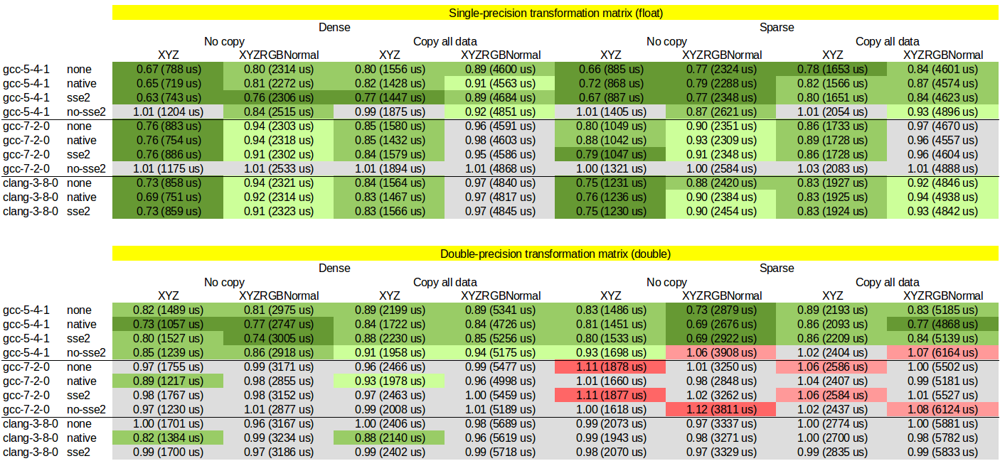

Optimization of PCL point cloud transform functions using SSE2 intrinsics.

1. Clone this repository with submodules (pass `--recursive` flag)

2. Configure with CMake

3. Build and run benchmarks: `make benchmarks`

4. Build and run tests: `make tests`

# Benchmarking results

Columns:
  * Dense: dense point clouds (thus no finity checks in transformation loop)
  * Sparse: sparse point clouds with 50% of invalid points
  * No copy: transform function only sets point coordinates, other fields are left uninitialized
  * Copy all data: transform function copies all fields and thes sets point coordinates
  * XYZ: point clouds with `pcl::PointXYZ` points
  * XYZRGBNormal: point clouds with `pcl::PointXYZRGBNormal` points

Rows:
  * none: no compiler flags (which means SSE2 are enabled on 64-bit machines)
  * native: `-march=native`, which means SSE2, AVX, FMA, etc. are enabled
  * sse2: `-msse2`
  * no-sse2: `-mno-sse2`

For every cell two tests are run: baseline PCL transform and proposed transform.
The input as a random VGA-sized point cloud. The reported number is the rutime
(in microseconds) for the proposed transform and the fraction of the baseline
time. Thus numbers less than `1.0` represent improved performance.
